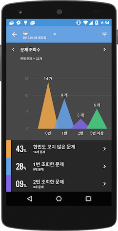
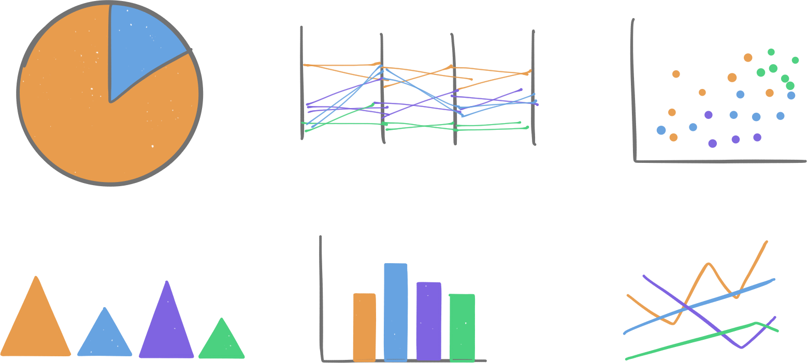
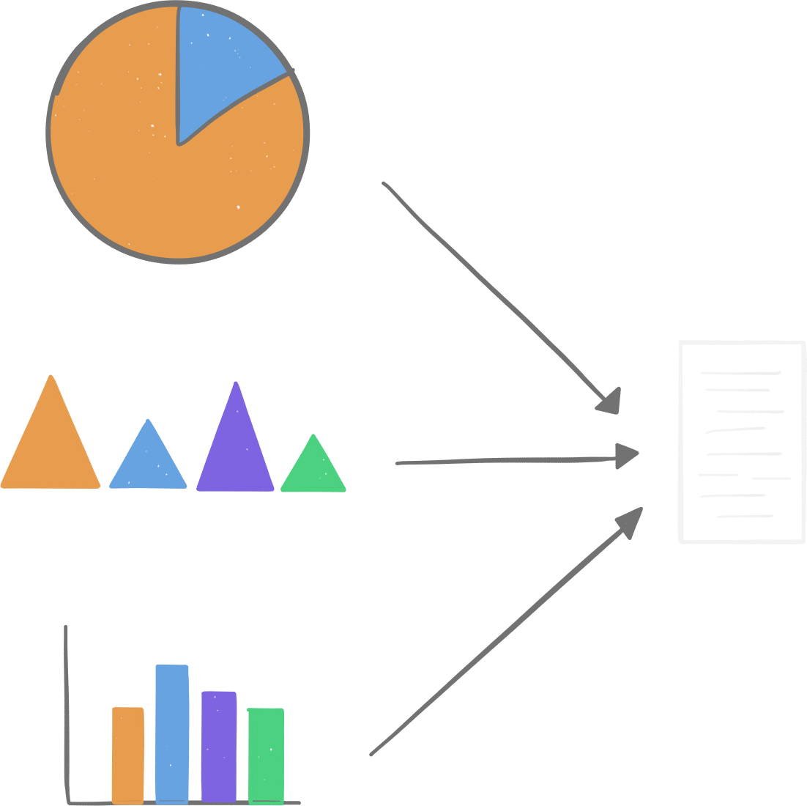
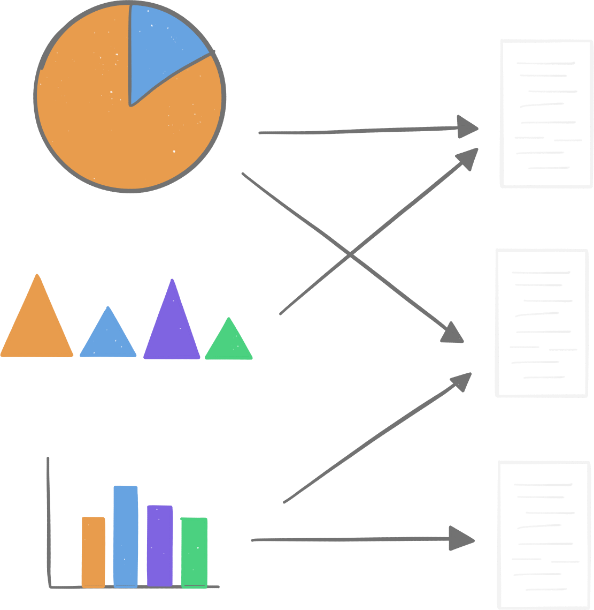

class: center, middle

<div id="triangles-intro"></div>

# 리액트와 디3
.degrade[디아블로3 아님 😅]
.footnote.pull-right[🍴  on [github](https://github.com/chitacan/react-with-d3)]

---
class: center, middle
# 왜?

.degrade[어쩌다가 이 둘을...]

---
.left-column[
  ## # 발단
]

.right-column[
  * `renote` 의 차트를 `D3` 로 만들게 되었음
  * 오 생각보다 재미진데?
  * `D3` 로 이것저것 실험하기 시작

  
]

---
.left-column[
  ## # 발단
  ## # 고민
]

.right-column[
하지만,

* 차트의 갯수가 늘어나고, 지원하는 OS 가 늘어나도,
* 활용하기 쉽게 만들 수 있을까?

<br/>
<br/>

]

---
.left-column[
  ## # 발단
  ## # 고민
]

.right-column[
`D3` 만으로는 어렵지 않을까?

* `D3` 는 재사용하기 편한 코드를 만드는 도구가 아님
* `D3` 의 결과물은 CSS, DOM 에 디펜던시를 가지고 있음
  * 다른 곳에 적용하기 위해서는 추가적인 작업이 필요함
  * 외부의 이벤트, 프로퍼티에 대응하기 위해서 추가적인 작업이 필요함

]

---
.left-column[
  ## # 발단
  ## # 고민
  ## # 💡
]

.right-column[
`react` 로 관리해보면 어떨까?

* 재사용 가능한 컴포넌트를 쉽게 만들 수 있고,
* `react` 의 이벤트, 프로퍼티 활용
* `Flux`, `Relay`, `GraphQL` 와 함께 scale-up 👯
]

---
.left-column[
  ## # 발단
  ## # 고민
  ## # 💡
]

.right-column[
다른 프로젝트에 적용하기도 수월해 지지 않을까?

  * 모든 코드를 포함한 `index.html` 하나만 릴리즈
  * 필요한 차트만 파일로 만들어 적용


]

---
.left-column[
  ## # 발단
  ## # 고민
  ## # 💡
]

.right-column[
다른 프로젝트에 적용하기도 수월해 지지 않을까?

  * 모든 코드를 포함한 `index.html` 하나만 릴리즈
  * 필요한 차트만 파일로 만들어 적용


]

---
class: center, middle

# 오호

.degrade[`D3` 로 만든 코드를 `react` 컴포넌트로 만들면,<br> 여러곳에서 활용하기 좋지 않을까?]

---
.left-column[
  ## # D3?
]

.right-column[
`Data Driven Document` == `DDD` == `D3`

다들 한번쯤은 보셨겠죠?

[이런 것들](http://bl.ocks.org/mbostock) 을 만들 수 있는 라이브러리
]

---
.left-column[
  ## # D3?
  ## # 편견
]

.right-column[
`D3` 는

* 차트 만들때나 쓰는거 아님? 💀
* svg 만 다루는 라이브러리 아님? 💀

`D3` 는

* 데이터와 연결된 `DOM` (html, svg)을 만들기 위한 라이브러리 🎉
* `데이터` 와 `DOM` 을 연결하는 다양한 도구(selection, scale, dynamic properties)를 제공
]

---
.left-column[
  ## # D3?
  ## # 편견
  ## # Selection
]

.right-column[

`데이터` 와 `DOM` 의 연결을 도와주는 `D3` 의 핵심 도구

* `D3` 로 놀기 위해서는 반드시 이해해야 하는 도구지만
* `D3` 를 시작하는 사람들에겐 가장 어려운 부분 😭

```coffeescript
selection = d3.selectAll 'rect'
  .data [1,2,3,4,5,6]

# enter
selection.enter()
  .append 'rect'
  .x (d, i) -> i
  .attr 'height', (d) -> d

# update
selection
  .x (d, i) -> i
  .attr 'height', (d) -> d

# exit
selection.exit().remove()
```
]

---
.left-column[
  ## # D3?
  ## # 편견
  ## # Selection
]

.right-column[
배열이 하나 있다고 💭 봅시다.

아이템의 갯수만큼 사각형 (`rect`) 을 그리고 싶습니다.

배열의 크기가 달라질 때마다 사각형의 갯수도 변할 수 있어야 합니다.
어떻게 구현하는 것이 좋을까요?

아래와 같이 배열의 아이템에 해당하는 사각형을 선택 (selection) 할 수 있는 함수가 있다만 간단할 겁니다.

* 추가되는 배열의 아이템 👉 enter()
* 삭제되는 배열의 아이템 👉 exit()

<div id="selection-demo"></div>
]

---
.left-column[
  ## # D3?
  ## # 편견
  ## # Selection
  ## # functional
]

.right-column[
`Selection` 은 데이터와 DOM 을 연결하는데 필요한 도구일 뿐 아니라, 함수형 코드를 작성하는 기본 단위

* 전달된 데이터만 같다면, `selection` 을 여러번 수행해도 항상 같은 DOM 을 볼 수 있음 (`render` 와 비슷?)
* 데이터를 다루는데 필요한 `동작` 을 선언할 수 있도록 도와줌
]

---
.left-column[
  ## # D3?
  ## # 편견
  ## # Selection
  ## # functional
]

.right-column[
`f(x) = y`

같은 `x` 를 주면 항상 같은 `y` 를 받을 수 있다.

* 같은 `상태` 를 주면 같은 `컴포넌트`가 그려진다 👉 `react`
* 같은 `데이터` 를 주면 같은 `DOM` 이 그려진다 👉 `D3`

이게 왜 중요하냐? 함수는 코드 재사용의 기본단위!!

* 뷰를 함수처럼 👉 재사용성 📈
* 문서를 함수처럼 👉 재사용성 📈

`D3` 는 다양한 데이터와 DOM 간의 연결에 집중하고 있기 때문에, 재사용성은 `react` 보다 부족함
]

---
class: center, middle

# 리액트와 디3

.degrade[서로의 장점을 활용하면?]

---
class: center, middle

# 연결해 봅시다.

---
.left-column[
  ## # API
]

.right-column[
자주 사용하게되는 `react` API 들

* `findDOMNode` (`getDOMNode` 🚮)
* `componentDidMount`
* `render`
* `componentDidUpdate`
* `componentWillUnmount`
]

---
.left-column[
  ## # API
  ## # create
]

.right-column[
별다른 고민없이 `componentDidMount` 에 모든 `D3` 코드를 다 때려 넣어도 됩니다 👻

```coffeescript
Tri = React.createClass

  componentDidMount: ->
    el = @getDOMNode()
    @W = @props.width
    @H = @props.height
    @svg = d3.select el
      .append 'svg'
      .attr 'width', @W
      .attr 'height', @H
    @canvas = @svg.append 'g'
    @renderTriangles randomize 5, 40
    @intervalID = setInterval =>
      @renderTriangles randomize 5, 40
    , 2000

  renderTriangles: (data)->
    # update, enter, exit

  render: ->
    <div className='triangles' style={style} />
```
]

---
.left-column[
  ## # API
  ## # create
]

.right-column[
별다른 고민없이 `componentDidMount` 에 모든 `D3` 코드를 다 때려 넣어도 됩니다 👻

<div id="triangles-demo" style="margin-top: 3em;"></div>
]

---
.left-column[
  ## # API
  ## # create
  ## # render
]

.right-column[
하지만 `setState` 를 통해 컴포넌트를 업데이트 하기 위해서는 `render` 또는 `componentDidUpdate` 를 활용

```coffeescript
componentDidMount: ->
  el = React.findDOMNode @
  oW = @props.width
  oH = @props.height

  W = oW - M - M
  H = oH - M - M

  svg = d3.select el
    .append 'svg'
    .attr 'width', oW
    .attr 'height', oH

  plot = svg.append 'g'
    .attr 'transform', "translate(#{M},#{M})"

  #...
  @setState { data:@randomize DATA, 0, 40 }
  @intervalID = setInterval =>
    @setState { data:@randomize DATA, 0, 40 }
  , 3000

componentDidUpdate: ->
  data = @state.data
  g.enter()
    .append 'g'
    .append 'path'
    .attr 'fill', 'none'
    .attr 'stroke', (d, i) -> COLORS[i]
    .attr 'd', (d) => @line d

  g.select 'path'
    .transition()
    .delay (d, i) -> i * ANIM_DELAY
    .attr 'd', (d) => @line d
    .duration ANIM_DURATION

  g.exit().remove()

  render: -> <div></div>
```
]

---
.left-column[
  ## # API
  ## # create
  ## # render
]

.right-column[
하지만 `setState` 를 통해 컴포넌트를 업데이트 하기 위해서는 `render` 또는 `componentDidUpdate` 를 활용

<div id="multiline-demo" style="margin-top: 3em;"></div>
]

---
class: center, middle

# 리액트를 좀 더 활용해 봅시다.

---
.left-column[
  ## # SVG
]

.right-column[
리액트는 html 엘리먼트 뿐만 아니라 svg 앨리먼트도 지원!!

https://facebook.github.io/react/docs/tags-and-attributes.html#svg-elements

```coffeescript
render: ->
  x = d3.scale.linear()
    .domain d3.extent @state.data
    .range [xMin, xMax]
  y = d3.scale.linear()
    .domain d3.extent @state.data
    .range [yMin, yMax]

  # create line
  line = d3.svg.line()
    .interpolate('monotone')
    .x (d, i) -> x(i)
    .y (d) -> y(d)

  <div>
*   <svg ref='svg' width={width} height={height}>
*     <path d={line(@state.data)} />
    </svg>
  </div>
```

]

---
.left-column[
  ## # SVG
]

.right-column[
`react`는 `html` 엘리먼트 뿐만 아니라 `svg` 앨리먼트도 지원!!

https://facebook.github.io/react/docs/tags-and-attributes.html#svg-elements

<div id="line-demo-1"></div>
]

---
.left-column[
  ## # SVG
  ## # render
]

.right-column[
렌더링을 모두 `react`에 맡기는 것도 가능합니다.
> from [github](https://github.com/znation/scalable-data-visualization), [youtube](https://www.youtube.com/watch?v=2ii1lEkIv1s&index=15&list=PLb0IAmt7-GS1cbw4qonlQztYV1TAW0sCr)

`D3` 만으로 구현하는 것보다 성능상의 이점이 있을까?

```coffeescript
render: ->
  data = this.props.data
  values = toArray data.getValues()
  <g>
    {values.map (value, idx) =>
      click = null
      scaleWidth = (this.props.width/(data.getDay())) + 0.5
      <rect
        fill='#48cc81'
        key={idx}
        x={0}
        y={0}
        width={1}
        height={1}
        style={{
          transition: '0.5s'
          cursor: if click is null then 'auto' else 'pointer'
          transform: translate(this.props.scales.x(idx), this.props.height - this.props.scales.y(value)) + " scaleY(#{this.props.scales.y(value)}) scaleX(#{scaleWidth})"
        }}
      />
    }
  </g>
```
]

---
.left-column[
  ## # SVG
  ## # render
]

.right-column[
렌더링을 모두 `react`에 맡기는 것도 가능합니다.

> from [github](https://github.com/znation/scalable-data-visualization), [youtube](https://www.youtube.com/watch?v=2ii1lEkIv1s&index=15&list=PLb0IAmt7-GS1cbw4qonlQztYV1TAW0sCr)

`D3` 만으로 구현하는 것보다 성능상의 이점이 있을까?

<div id="histogram-demo"></div>
]

---
.left-column[
  ## # SVG
  ## # All
  ## # Event
]

.right-column[
`react` 와 `D3` 의 이벤트를 모두 사용할 수 있음.

하지만 `mousemove` 와 같이 정확한 포인트가 필요한 경우 `D3` 의 이벤트를 사용하는 것이 더 편리함.

<div id="line-demo-2"></div>
]

---
.left-column[
  ## # SVG
  ## # All
  ## # Event
]

.right-column[
`react` 와 `D3` 의 이벤트를 모두 사용할 수 있음.

하지만 `mousemove` 와 같이 정확한 포인트가 필요한 경우 `D3` 의 이벤트를 사용하는 것이 더 편리함.

```coffeescript
componentDidMount: ->
  self = @
  d3.select React.findDOMNode @refs.svg
    .on 'mousemove', ->
      self.handleMouseMove d3.mouse @

handleMouseMove: (point)->
* x = @x.invert point[0] / @getScaleFactor()
  i = d3.bisect X_RANGE, x
  d0 = X_RANGE[i - 1]
  d1 = X_RANGE[i]
  @setState point: if i - d0 > d1 - i then d1 else d0

render: ->
  @x = d3.scale.linear()
    .domain([0, 30])
    .range [xMin, xMax]
  @y = d3.scale.linear()
    .domain(d3.extent @state.data )
    .range [yMin, yMax]

  if @state.point? and highlight
    p = @state.point
    circle = <circle cx={@x(p)}
                     cy={@y(@state.data[p])}
                     r={6}
                     style={circleStyle}/>
  <div className='center'>
    <svg ref='svg' width={width} height={height}>
      <path d={line(@state.data)} style={pathStyle} />
      {circle}
    </svg>
  </div>
```
]

---
class: center, middle

# `react-d3` 는 어떤가요?

[https://github.com/esbullington/react-d3](https://github.com/esbullington/react-d3)

.degrade[`D3` 의 차트를 `react` 컴포넌트로 만든것]

---
class: center, middle

# 결론

.degrade[`D3` 를 `react` 컴포넌트화]

---
.left-column[
  ## # 얻는 것?
]

.right-column[
* `react` 빠 인증 ? 👅
* `D3` 코드의 재사용성 극대화
* `react` 스러운 데이터 흐름, 이벤트 처리
* css 도 js 파일에
* 성능.. 어떻게 비교할 수 있을까?
]

---
## 재사용성의 극대화?

사실 이 슬라이드의 데모는 모두 `D3`로 그려지는 `react` 컴포넌트 🙋

`slide.md`

```html
<div id="triangles"></div>
```

`app.coffee`

```coffeescript
Triangles   = require './components/triangles.coffee'

slides.on 'beforeShowSlide', (slide)->
  switch slide.getSlideIndex()
    when 19
*     React.render <Triangles width={400} height={200}/>,
*     getEl 'triangles-demo'

slides.on 'hideSlide', (slide)->
  switch slide.getSlideIndex()
*   when 19 then React.unmountComponentAtNode getEl 'triangles-demo'
```

---
.left-column[
  ## # 얻는 것?
  ## # 잃는 것?
]

.right-column[
* 우아한 `D3` 의 `enter`, `update`, `exit` 패턴
* 집중력 & 심플함 (늘어나는 js 파일들...)
]

---
.left-column[
  ## # 얻는 것?
  ## # 잃는 것?
  ## # 결국
]

.right-column[
* 데이터와 DOM 연결을 우아하게 할 것인가?
* 재사용성을 극대화 할 것인가?

서로의 장점을 살릴 수 있는 조합법이 👍
]
